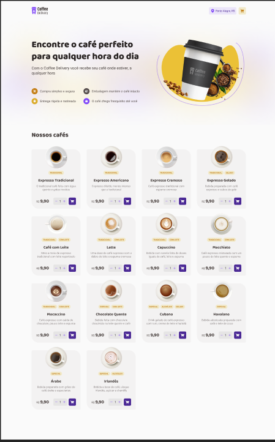
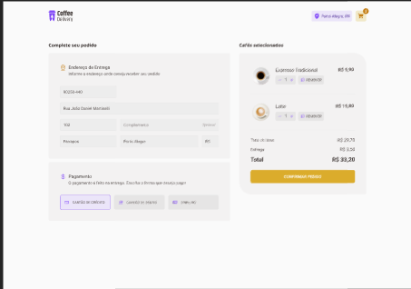
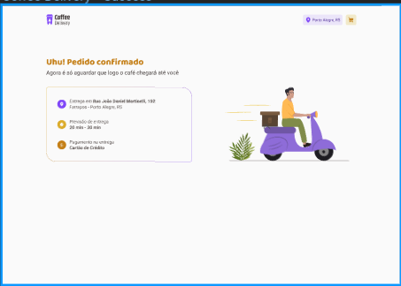

<h1>Projeto Coffee Delivery</h1>

Neste projeto foram proposto vários desafios

Utilizando mais funções do ReactJS para deixar o projeto robusto, com isso aumentando o conhecimento.

- Listagem de produtos (cafés) disponíveis para compra
- Adicionar uma quantidade específicas de itens no carrinho
- Aumentar ou remover a quantidade de itens no carrinho
- Formulário para o usuário preencher o seu endereço
- Exibir o total de itens no carrinho no Header
- Exibir o valor total da soma de itens no carrinho multiplicados pelo valor

Apesar de serem poucas funcionalidades, precisei utilizar conceitos como:

- Estados
- ContextAPI
- LocalStorage
- Imutabilidade do estado
- Listas e chaves no ReactJS
- Propriedades
- Componentização

Para completar esse desafio, percebi a  necessitar de pesquisas para aprender sobre métodos de manipulação de arrays como o `reduce` que é extremamente útil para o cálculo do valor total do carrinho.

<h2>Página Home</h2>

<h2>Página para efetuar o cadastro de endereço e confirmar o pagamento</h2>

<h2>Página de envio do delivery</h2>

